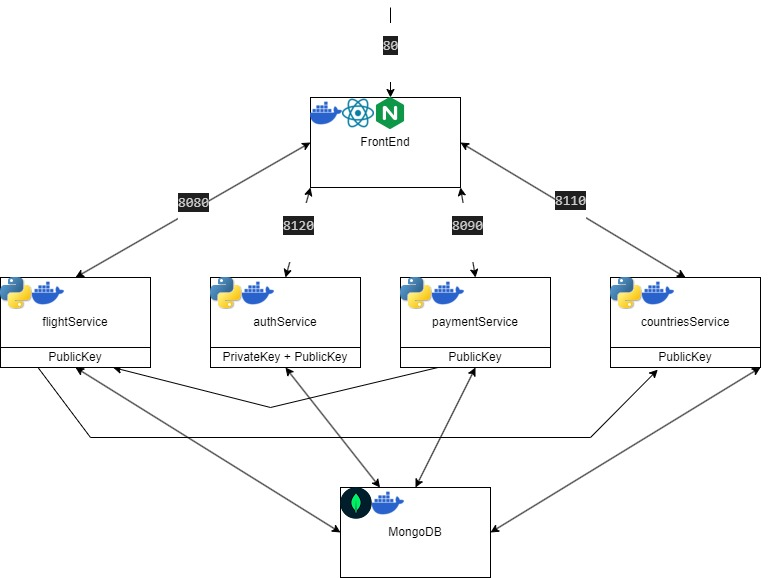

# Flight App

Simple Flight App web application on 6 docker containers:
- :27127 - MongoDB image.
- :8120  - Auth service - fastapi.
- :8110  - Countries service - fastapi.
- :8080  - Flight service - fastapi.
- :80    - frontend - react.ts wraped with nginx.
- :8090  - Payment service - fastapi.

# video
[Youtube Link](https://youtu.be/aHlG-uUYaMc)

<video src="./readmeFiles/video.mp4" controls></video>

#  instalation
1. Clone the repository to your local machine:
```
git clone https://github.com/EASS-HIT-PART-A-2024-CLASS-IV/flight-company-website.git
```
2. Make sure Docker is installed.
```
docker --version
```
3. Run from the directory:
```
cd ./FlightCompany
docker-compose up --build -d
```
4. Go to http://localhost to play with the app!

# Project Tree

```
FlightCompany
├─ auth-service
│  ├─ Dockerfile
│  ├─ main.py
│  ├─ requirements.txt
│  └─ verification.py
├─ countries-service
│  ├─ countries.json
│  ├─ Dockerfile
│  ├─ main.py
│  └─ requirements.txt
├─ docker-compose.yml
├─ flight-service
│  ├─ .dockerignore
│  ├─ Dockerfile
│  ├─ main.py
│  ├─ requirements.txt
│  └─ verification
│     └─ index.py
├─ frontend
│  ├─ .dockerignore
│  ├─ .gitignore
│  ├─ Dockerfile
│  ├─ nginx.conf
│  ├─ package-lock.json
│  ├─ package.json
│  ├─ public
│  │  ├─ ...
│  ├─ src
│  │  ├─ api
│  │  │  ├─ auth-service
│  │  │  │  └─ index.ts
│  │  │  ├─ baseService
│  │  │  │  └─ index.ts
│  │  │  ├─ contries-service
│  │  │  │  └─ index.ts
│  │  │  ├─ flight-service
│  │  │  │  └─ index.ts
│  │  │  ├─ payment-service
│  │  │  │  └─ index.ts
│  │  │  └─ service.locator.ts
│  │  ├─ App.tsx
│  │  ├─ components
│  │  │  ├─ CreateFlight
│  │  │  │  └─ index.tsx
│  │  │  ├─ FlightsTable
│  │  │  │  ├─ FlightsTable.css
│  │  │  │  └─ index.tsx
│  │  │  ├─ ResponsiveAppBar
│  │  │  │  └─ index.tsx
│  │  │  ├─ SearchFlight
│  │  │  │  └─ index.tsx
│  │  │  └─ SeatBooking
│  │  │     ├─ CreditCardForm
│  │  │     │  └─ index.tsx
│  │  │     ├─ FlightDetails
│  │  │     │  └─ index.tsx
│  │  │     ├─ index.tsx
│  │  │     ├─ PersonalInfoForm
│  │  │     │  └─ index.tsx
│  │  │     ├─ PurchaseComplete
│  │  │     │  └─ index.tsx
│  │  │     └─ SeatSelection
│  │  │        └─ index.tsx
│  │  ├─ config
│  │  │  └─ index.ts
│  │  ├─ index.css
│  │  ├─ index.tsx
│  │  ├─ pages
│  │  │  ├─ Booking
│  │  │  │  └─ index.tsx
│  │  │  ├─ Flights
│  │  │  │  └─ index.tsx
│  │  │  ├─ Home
│  │  │  │  └─ index.tsx
│  │  │  ├─ Login
│  │  │  │  └─ index.tsx
│  │  │  └─ Register
│  │  │     └─ index.tsx
│  │  ├─ routes
│  │  │  ├─ index.tsx
│  │  │  └─ protected.route.tsx
│  │  └─ shared-components
│  │     └─ inputs
│  └─ tsconfig.json
├─ mongo
└─ payment-service
   ├─ Dockerfile
   ├─ main.py
   ├─ requirements.txt
   └─ verification
      └─ index.py
```

# Requirements
- Docker 
# Design Diagram:
</img>

# Author
gil reuven